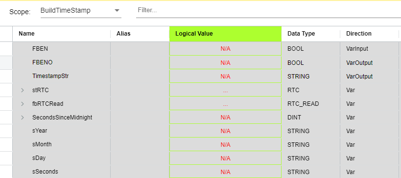
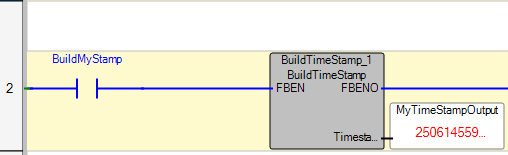

# BuildTimeStampUDFB.st

This project contains a Structured Text (ST) file named `BuildTimeStampUDFB.st`.

## Overview
`BuildTimeStampUDFB.st` is a User Defined Function Block (UDFB) for Rockwell Automation Micro800 PLCs. It generates a unique timestamp string from the PLC's Real Time Clock (RTC) in the format YYMMDDSSSSS (YY=year, MM=month, DD=day, SSSSS=seconds since midnight, all zero-padded). This is useful for versioning, diagnostics, and logging in automation projects.

## Variable Overview
Below is a visual representation of the UDFB's variables as seen in Connected Components Workbench:

- **Inputs:**
  - `FBEN` (BOOL): Function Block Enable. Set to TRUE to execute the timestamp generation.
- **Outputs:**
  - `FBENO` (BOOL): Set to TRUE when the timestamp has been generated.
  - `TimestampStr` (STRING[12]): The generated unique timestamp string in the format YYMMDDSSSSS.
- **Internal:**
  - `stRTC` (RTC): Structure holding RTC data (populated by RTCREAD).
  - `SecondsSinceMidnight` (DINT): Calculated seconds since midnight.

## Usage Example
To use the UDFB in a ladder logic program, instantiate it as shown below. The following image demonstrates the UDFB in a typical Micro800 ladder logic environment:

- Enable the function block with `FBEN := TRUE`.
- When `FBENO` is TRUE, `TimestampStr` contains the generated timestamp.

## Example Output
For June 14, 2025, at 15:28:51:
- Year: 25 → "25"
- Month: 06 → "06"
- Day: 14 → "14"
- Seconds since midnight: 15*3600 + 28*60 + 51 = 55731 → "55731"
- Output: `TimestampStr = "25061455731"`

## File Structure
- `BuildTimeStampUDFB.st`: Main Structured Text file containing the UDFB implementation.
- `Images/UDFB_Vars.png`: Screenshot of the UDFB variable table.
- `Images/UDFB_In_Ladder.png`: Screenshot of the UDFB in a ladder logic program.

## Requirements
- Rockwell Automation Micro800 PLC
- Connected Components Workbench (CCW)
- IEC 61131-3 Structured Text support
- Real Time Clock (RTC) must be available in the PLC

## License
This code is released under the [The Unlicense](https://unlicense.org/). You are free to use, modify, and distribute it without restriction.

## Author
Adam G. Sweeney

---
*Generated on June 14, 2025.*
